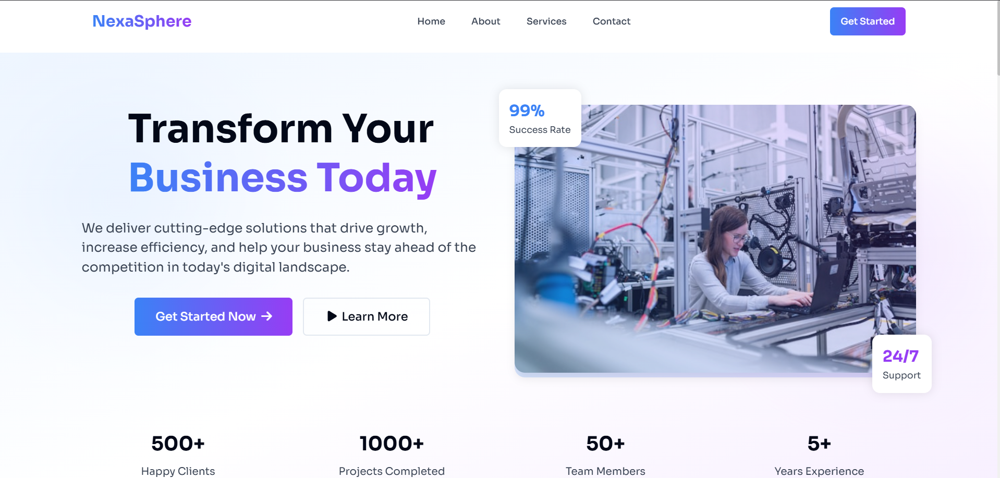
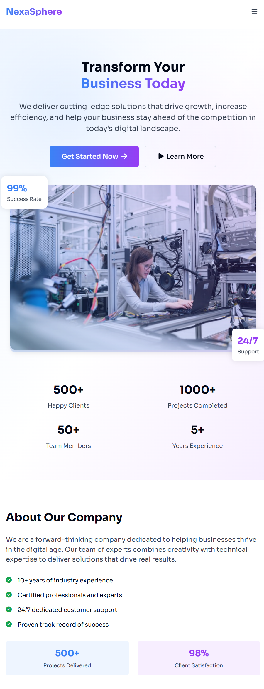

# NexaSphere Landing Page

## Table of Contents
- [Project Overview](#project-overview)
- [Features](#features)
- [Live Demo](#live-demo)
- [Screenshots](#screenshots)
- [Tech Stack](#tech-stack)
- [Folder Structure](#folder-structure)
- [Setup & Installation](#setup--installation)
- [Design & User Experience](#design--user-experience)
- [Accessibility](#accessibility)
- [Animations & Interactivity](#animations--interactivity)
- [Extensibility & Customization](#extensibility--customization)
- [Best Practices & Code Quality](#best-practices--code-quality)
- [Contact](#contact)

---

## Project Overview

**NexaSphere** is a modern, responsive, and visually engaging landing page designed for a professional services company. The project demonstrates advanced front-end development skills, including semantic HTML, modular CSS, accessibility, smooth animations, and interactive UI elements. It is built as a single-page application (SPA) with a focus on user experience, performance, and scalability.

This project was developed as part of a company job assignment to showcase expertise in web design, front-end engineering, and best practices in modern web development.

---

## Features
- **Fully Responsive Design:** Adapts seamlessly to all screen sizes (mobile, tablet, desktop).
- **Modern UI/UX:** Clean, professional, and visually appealing layout with a focus on usability.
- **Animated Navigation:** Sticky header with animated mobile menu and smooth section scrolling.
- **Hero Section:** Eye-catching hero with animated stats, call-to-action buttons, and floating cards.
- **About Section:** Company overview, features, and core values with animated cards.
- **Services Section:** Grid of service cards, each with unique color themes and interactive hover effects.
- **Contact Section:** Accessible contact form with validation, business hours, and contact methods.
- **Footer:** Social links, company info, and dynamic copyright.
- **GSAP Animations:** Advanced scroll-based and entrance animations for enhanced engagement.
- **Accessibility:** Semantic HTML, ARIA labels, keyboard navigation, and color contrast.
- **Performance Optimized:** Minimal dependencies, optimized images, and efficient CSS/JS.

---

## Live Demo

[View the Live Demo on Vercel](https://nexa-sphere.vercel.app/)

---

## Screenshots
-- **Desktop view of the NexaSphere landing page, showcasing the hero section, navigation, and animated stats.**



-- **Mobile view of the NexaSphere landing page, demonstrating responsive design and mobile navigation.**


---

## Tech Stack
- **HTML5**: Semantic, accessible markup
- **CSS3**: Custom properties, responsive grid/flexbox, modular BEM naming
- **JavaScript (ES6+)**: Modular, event-driven, and unobtrusive
- **GSAP (GreenSock Animation Platform)**: For advanced animations and scroll effects
- **Font Awesome**: Iconography
- **Google Fonts (Sora)**: Typography

---

## Folder Structure
```
Landing Page/
├── index.html        # Main HTML file (SPA)
├── index.css         # All styles (BEM, custom properties, responsive)
├── index.js          # All JS (modules for nav, scroll, animation, form, footer)
└── README.md         # Project documentation (this file)
```

---

## Setup & Installation

1. **Clone the Repository**
   ```sh
   git clone <repo-url>
   cd "Landing Page"
   ```

2. **Open in Browser**
   - Simply open `index.html` in your preferred browser.
   - No build tools or server required (pure static site).

3. **Dependencies**
   - All dependencies are loaded via CDN (Font Awesome, GSAP, Google Fonts).
   - No local installation required.

4. **Optional: Local Server**
   For local development with live reload:
   ```sh
   npx serve .
   # or use Live Server extension in VSCode
   ```

---

## Design & User Experience

- **Branding:** Consistent color palette using CSS custom properties for easy theming.
- **Typography:** Modern, readable font (Sora) with clear hierarchy.
- **Layout:** Responsive grid and flexbox layouts for all sections.
- **Call-to-Action:** Prominent buttons and clear navigation to drive user engagement.
- **Visual Hierarchy:** Use of gradients, cards, and iconography to guide the user.
- **Mobile First:** Designed and tested for mobile usability and touch interactions.

---

## Accessibility

- **Semantic HTML:** Proper use of `<header>`, `<nav>`, `<main>`, `<section>`, `<footer>`, and ARIA labels.
- **Keyboard Navigation:** All interactive elements are accessible via keyboard (Tab, Enter, Space).
- **Color Contrast:** Meets WCAG AA standards for text and UI elements.
- **Form Accessibility:** Labels, required fields, and ARIA attributes for the contact form.
- **Screen Reader Support:** Descriptive alt text, ARIA roles, and logical DOM order.

---

## Animations & Interactivity

- **GSAP Animations:**
  - Entrance animations for hero, about, services, and contact sections.
  - Scroll-triggered animations for section content and cards.
  - Animated mobile menu (slide in/out, staggered links).
- **Smooth Scrolling:**
  - Navigation links and buttons use smooth scroll to target sections.
- **Form Handling:**
  - Contact form uses JavaScript for simulated async submission, loading state, and reset.
- **Sticky Navigation:**
  - Header changes style on scroll for better visibility.

---

## Extensibility & Customization

- **Easy Theming:**
  - Change primary colors, gradients, or fonts via CSS variables in `:root`.
- **Add/Remove Sections:**
  - Each section is modular and can be duplicated or removed as needed.
- **Add Services:**
  - Add new service cards by copying the `.service__card` block in HTML and updating content.
- **Integrate Backend:**
  - The contact form is ready for integration with backend APIs (e.g., using Fetch/AJAX).
- **Componentization:**
  - The codebase is structured for easy migration to frameworks like React, Vue, or Angular if needed.

---

## Best Practices & Code Quality

- **BEM Naming Convention:**
  - All CSS classes follow Block__Element--Modifier for clarity and maintainability.
- **Separation of Concerns:**
  - HTML, CSS, and JS are modular and well-organized.
- **Performance:**
  - Minimal DOM manipulation, optimized selectors, and efficient event handling.
- **Comments & Documentation:**
  - Code is commented for clarity, and this README provides full project context.
- **No External Build Tools:**
  - Pure static site for maximum compatibility and portability.

---

## Contact

For any questions, feedback, or collaboration opportunities:

- **Email:** hello@NexaSphere.com
- **Phone:** +91 0123456789
- **Author:** Ramandeep Singh

---

> _This project was developed as a demonstration of front-end engineering skills for a company job assignment. All code, design, and documentation are original and crafted to professional standards._ 